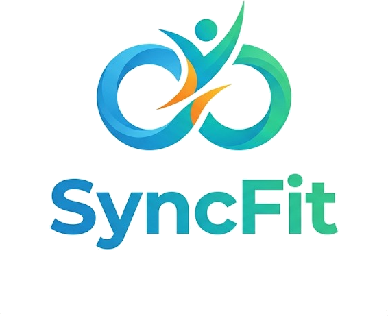

<div align="center">



# SyncFit

### Platforma de wellbeing corporativ cu AI, pentru angajații care vor să se simtă bine la muncă

[](https://spring.io/)
[](https://react.dev/)
[](https://supabase.com/)
[](https://ai.google.dev/)
[](/)

**Construit în 24 de ore la HackItAll April 2026 — București**

</div>

---

## Ce face SyncFit?

SyncFit este o aplicație web pentru angajați din mediul corporativ care ajută la trei lucruri simple:

1. **Îți amintește să faci pauze** — analizează programul tău de întâlniri și îți spune când e momentul să te ridici de la birou
2. **Îți găsește colegi pentru sport** — potrivește angajații din aceeași companie după sporturile preferate
3. **Îți dă sfaturi de wellbeing prin AI** — un asistent disponibil oricând pentru nutriție, ergonomie sau motivație

---

## Funcționalități principale

### 🧠 Pauze inteligente
Aplicația se uită la calendarul tău și detectează când ai prea multe întâlniri la rând fără pauză. Dacă ești blocat în meetings mai mult de 90 de minute, îți sugerează automat o pauză — cu activitate generată de AI în funcție de energia ta din momentul respectiv.

### 🤝 Matchmaking sportiv
Vrei să joci padel cu cineva din birou? SyncFit caută colegi cu aceleași sporturi preferate, din același oraș, și generează o prezentare personalizată pentru fiecare potrivire. Rezultatele sunt calculate printr-un algoritm de compatibilitate + AI.

### 💬 Asistent AI integrat
Un chatbot floating în colțul ecranului, disponibil oricând. Poți să-l întrebi despre stretching, hidratare, echipament sportiv sau ce să mănânci la prânz. Răspunde în stilul pe care tu îl setezi din profil — formal, prietenos, direct sau empatic.

### 📊 Tracking zilnic
Urmărești câte pauze ai luat azi, streak-ul de zile active, puncte EcoPoints câștigate și câte activități sportive ai organizat luna asta.

### 😔 Intervenție la stres
Dacă după o pauză raportezi că te simți mai rău decât înainte, asistentul AI se deschide automat cu un mesaj empatic și propune o activitate care să te ajute.

---

## Cum arată aplicația

| Pagină | Ce face |
|--------|---------|
| **Dashboard** | Centrul de comandă — statistici personale, sportul zilei, buton de pauză, stare curentă |
| **Pauze** | Timeline-ul zilei cu toate pauzele, slider de stare, istoric activitate |
| **Program** | Calendar cu toate pauzele programate pentru azi |
| **Matches** | Caută sport, primești lista de colegi potriviți cu mesaj AI personalizat |
| **Profil** | Configurezi sporturile, locația de muncă, stilul asistentului AI, limitele de sănătate |

---

## Tehnologii folosite

**Backend**
- Java 17 + Spring Boot 3 — serverul și toată logica
- Spring Data JPA — comunicare cu baza de date
- PostgreSQL pe Supabase — baza de date în cloud

**Frontend**
- React 18 + Vite — interfața utilizatorului
- Tailwind CSS — stilizare
- React Router — navigare între pagini

**AI**
- Google Gemini 2.5 Flash — 3 chei separate pentru chat, matchmaking și sugestii de pauze

---

## Pornire locală

### Ce ai nevoie instalat
- Java 17+
- Maven 3.8+
- Node.js 18+

### Pași

```bash
# 1. Clonează repo-ul
git clone https://github.com/dragoscocs/HackitAll-RAMsarii.git
cd HackitAll-RAMsarii

# 2. Pornește backend-ul
cd backend
mvn spring-boot:run
# Rulează pe http://localhost:8080

# 3. Pornește frontend-ul (terminal separat)
cd frontend
npm install
npm run dev
# Rulează pe http://localhost:5173
```

Deschide [http://localhost:5173](http://localhost:5173), creează un cont și ești gata.

---

## Conturi demo

Câteva conturi pre-configurate în baza de date cu profiluri complete:

| Email | Parolă | Sporturi |
|-------|--------|---------|
| `gigel@ecosync.ro` | `password` | Padel, Tennis |
| `andrei@ecosync.ro` | `password` | Tennis, Running |
| `elena@ecosync.ro` | `password` | Padel, Running |

---

## Structura proiectului

```
├── backend/                  # API Java Spring Boot
│   └── src/main/java/com/ecosync/
│       ├── controller/       # Endpoint-uri REST
│       ├── service/          # Logica de business + integrare AI
│       ├── model/            # Modele de date
│       └── repository/       # Interogări bază de date
│
├── frontend/                 # Interfața React
│   └── src/
│       ├── components/       # Componente UI (Dashboard, Matches, etc.)
│       ├── pages/            # Paginile aplicației
│       └── context/          # State management (auth, calendar)
│
└── README.md
```

---

<div align="center">

Construit cu ☕ și prea puțin somn de **Echipa RAMsarii**

*HackItAll April 2026 — București*

</div>
